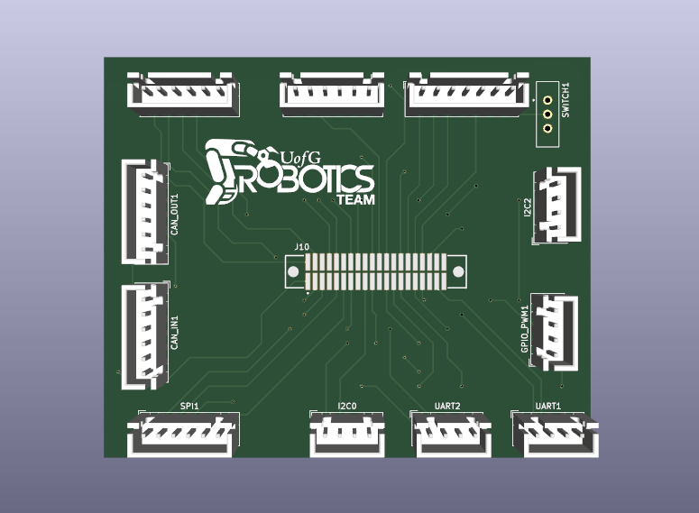

<h1 align = "center">Rudi 40-Pin Breakout</h1>

As a member of the University of Guelph Robotics Team, I've taken on the exciting challenge of designing a 40-pin breakout board for the Rudi-NX. This marks a significant milestone as my first board design. Leveraging KiCad, I've implemented a PCB breakout for the GPIO Expansion Connector on the Rudi-NX, bringing together various communication protocols and input/output pins. 

 

<h1 align = "center"> Design + 3D Viewer</h1>

  
  

  

